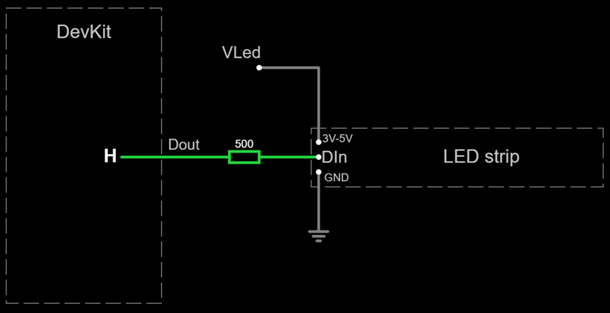

# RGB LED library with non-blocking multi-threading support

This project features a modern C++ library for
displaying pixels in RGB LED strips.
It is designed to be extensible to other RGB LED controllers
and CPU architectures, not only LED strips.
It capitalizes experience from
[another project](https://github.com/afpineda/OpenSourceSimWheelESP32).

The code is organized as an Arduino library,
but does not use Arduino code,
so it can be used in ESP-IDF with minimal changes.

## Supported hardware

- Any pixel driver using 8-bit per color channel (red, green and blue):
  WS2811, WS2812, WS2815, SK6812 and UCS1903,
  or any other driver if you provide the working parameters.

- ESP32 architecture.

## Features

- Can work in open-drain mode to avoid having a complex voltage level shifter.

- RGB and HSL color models.

  You can use one model or the other on each pixel.
  Conversion is automatic.
  There is implicit conversion from/to packed RGB format.
  This is independent from the pixel format required by the pixel driver.

- Brightness reduction factor for all pixels (optional).

- Display pixels all at once.

  Compute each pixel color individually then display them all at once.
  No need for shared variables or thread synchronization.

- Display pixels in reverse order (optional),
  so your code does not depend on the physical arrangement of the LED strip.

- Display based on priorities (optional).

  When having multiple threads using the same LED strip,
  a thread can obtain exclusive access without blocking semantics.
  The display priority is independent from the thread priority.
  This works on non-threaded applications, too.

- Handy shutdown method to prepare for deep sleep modes.

- Extensible to other RGB LED controllers (not just LED strips)
  and hardware architectures. Please, contribute.

- Code specifically optimized for the ESP32 architecture
  (no Arduino bloatware):
  - Based on the Remote Control Transceiver (RMT) API.
  - Using custom encoders for this application.

- DMA mode (optional).

  The library transparently falls back to PIO mode if not available.

- Automated tests. To run them in a PC or virtual machine,
  the GNU C++ compiler and Powershell are required.

Take a look at the provided [examples](./examples/README.md)
and the [API documentation](https://afpineda.github.io/ESP32-RGB-LEDStrip).

### Level shifting and power for RGB LED strips

- **No level shifter**

  If your LED strip works with the same voltage as your
  DevKit board, use the following configuration:

  

  [Show at falstad.com](https://falstad.com/circuit/circuitjs.html?ctz=CQAgjCAMB0l3BWcMBMcUHYMGZIA4UA2ATmIxAUgoqoQFMBaMMAKAHcQnDOxuuRCAFigsAHjzScinDHinYQwsHIBqAGToATMTwV5uYJHmKLwcgCIBJAHYsARp2wIUnPFSZ4kKbOUj2pwoImKMRUzC5+4gwhcgyCsSiC7oJIwpLmdABuANIAlgAuOsxy+iBoVMamkmoAouYAOgDOjfkATrkADuw83MR8vOAocn4A5j2DsQO8VDM6TC5CZVSE5Eou2CoMCCpzYGGQBgaQJmsgAOIAcubd-G6ci3d+HAx3-G8Dfq33wq9gQyCPGh+NQSEruRIVGbgEAAMwAhgAbRp0EDYaAKSI8WQgDAuJgpHGpcDccwAewAroUgA)

  Wire `Dout` to `Din` in the first pixel via a 300 to 1000 ohm resistor.
  The resistor should be at the end of the wire closest to the LED strip,
  not the DevKit board.
  This resistor can be omitted only
  if your LED strip already has a resistor in `Din`.
  Otherwise your LED strip could burn out.

  Then, tell this library not to use open-drain mode in `Dout`.

- **Simple level shifter**

  If your LED strip works with an higher voltage than your
  DevKit board, use the following configuration:

  

  [Show at falstad.com](https://falstad.com/circuit/circuitjs.html?ctz=CQAgjCAMB0l3BWcMBMcUHYMGZIA4UA2ATmIxAUgoqoQFMBaMMAKACcQG8rvPenCUZHBYAPTmF4YUEgCzkMSWeEEARAPYBXAC4sA7hMEDDIQssgsASnyrGmYGcapVZtIc+gIxEtJyKcMPD9sEGVJEAA1ABk6ABNvJhC8QTAkPGJQ8CDVAEkAOxYAI05sBEd+SSQUbHILYoYUZVkMlGIqZhkLcQbiIIZZPsbbWSUQX1U6ADcAaQBLXXFmIOSxuBB0zN8ogFFVAB0AZwPtNlmAB30TYiMwFJQgiwBzEwc+25VnKASHU2UZQnIYRkCAi33akBSKUgGSBIAA4gA5VSXYz8Xi8FAoio3HFfAxcHi2NDLZwJbDvMDSCTEMKKTI-AAU6jOdDyh1ibAAhrM2UdZgBbTQAG052lm6jyAEoWAc-Ph1kSqa93CATpo6Cxng0lfc-ErZOYvvVcMozHKZKkHiwgA)

  Then, tell this library to use *open-drain mode* in `Dout`.

  If `VLed` is higher than 5V you must increase the resistor value
  to limit the current into `Dout` to 15mA or less.

Tag notation:

- You must wire `Dout` pads to `Din` pads.
- `Din` an `Dout` pads must be in the same (unnamed) net.
  Do not wire `Dout` to `Dout` or `Din` to `Din`.
  It does not work.
- `Vled` is the DC voltage required by the LED strip.

#### Using a 3V3 power supply with LED strips requiring a 5V power supply

Most LED strips require a 5V power supply
and show wrong colors when powered with a 3V3 power supply
(but they work).
To overcome this, set the global brightness to `127` or less.
This workaround will show inaccurate but correct colors without the need
to provide a 5V power supply.

```c++
WS2812LEDStrip strip(8, DATA_PIN, OPEN_DRAIN);
strip.brightness(127);
```

### Display pixels all at once

Declare a local `PixelVector` object to handle pixel colors.
This type is derived from `std::vector` adding some handy methods:

- Fill all pixels with a single color.
- Shift pixels up or down.

Pass that object to `LEDStrip::show()` to show the pixels all at once.
This method is thread-safe but, in this way, no thread has
exclusive access to the LED strip.

```c++
WS2812LEDStrip strip(PIXEL_COUNT, DATA_PIN, OPEN_DRAIN);
PixelVector pixels(7);
pixels[0] = 0x0EE82E;
pixels[1] = 0x4B0082;
pixels[2] = 0x0000FF;
pixels[3] = 0x008000;
pixels[4] = 0xFFFF00;
pixels[5] = 0xFFA500;
pixels[6] = 0xFF0000;
strip.show(pixels);
```

To explicitly set RGB channels (example):

```c++
pixels[5].red   = 0xFF;
pixels[5].green = 0xA5;
pixels[5].blue  = 0x00;
```

To explicitly set HSL channels (example):

```c++
// Parameters: hue, saturation, luminance
pixels[5].hsl(39,255,127);
```

Note the parameter units and ranges (no floating point required):

- Hue: integer degrees in the range [0,359].
- Saturation and luminance: integer in the range [0,255].
  Divide by 255 and multiply by 100 to know the value in percentage.

### Display based on priorities

A thread can have exclusive access to an LED strip
**without blocking other threads** using the same LED strip.

`RgbGuard` works the same way as `std::lock_guard`,
but non-blocking:

```c++
// Acquire a guard with priority 6
RgbGuard guard(strip, 6);
PixelVector pixels(8);
// Fill pixels
 ...
// Display unless another thread acquired an higher priority
guard.show(pixels);
```

As simple as that.
This works with non-threaded applications as well.
The guard is automatically released when the `guard` variable
goes out of scope.

### Additional notes

- The size (count of pixels) of a `PixelVector` instance
  is not required to match the count of pixels in the `LEDStrip` instance.
  It works with any size.

- To create a `PixelVector` instance that matches the size of a
  `LEDStrip` instance, let's say `led_strip`:

  ```c++
  PixelVector pixels(led_strip.parameters().size());
  ```

- It is recommended to call `LEDStrip::shutdown()` at program startup
  because pixels continue to lit after a system reset.

- The count of pixels in the `LEDStrip` instance is used in the
  `shutdown()` method only.

## Experimental support for LED matrices

> [!IMPORTANT]
> The support for LED matrices has not been tested using real hardware.

An LED matrix is simply a regular LED strip with
a specific pixel arrangement in rows and columns.

Features:

- Any pixel driver already supported for LED strips.
- Any size.
- Any wiring schema via three parameters:

  - Location of the first pixel
  - Internal wiring (serpentine or linear)
  - Arrangement in rows or columns.

  See an [example](./doc/LedMatrixWiringSchemas.md).

- All the features of LED strips,
  including prioritized display.

> [!NOTE]
> Tiling is not supported.

### Concepts and involved classes

- The `LEDStrip` class (and descendants) also represents
  an LED strip able to display pixels in a 2D matrix.
  For better semantics, you may use the `LEDMatrix` alias instead.
  To create an LED matrix use the second constructor:

  ```c++
  LEDStrip(
        const LedMatrixParameters &params,
        int dataPin,
        bool openDrain,
        bool useDMA,
        PixelDriver pixelDriver);
  ```

- Class `LedMatrixParameters`:
  specifies the physical arrangement of pixels in the underlying LED strip.
- Class `PixelMatrix`: holds a
  "[raster graphic](https://en.wikipedia.org/wiki/Raster_graphics)"
  in the usual *row-major* format.
  You can take advantage of raster graphic libraries
  thanks to `PixelMatrix::data()`.
  This is an specialization of `PixelVector` (and `std::vector<Pixel>`).

### LEDMatrix and PixelMatrix sizes

The size (the number of rows and columns)
of the physical LED matrix must match the size of the `PixelMatrix` instance,
**but the library does not enforce this**.
Otherwise, the library will display pixels in the wrong LEDs.
To ensure this constraint, you have two options:

- Via assertions, for example:

  ```c++
  #include <cassert>
  ...
  PixelMatrix pixel_matrix(24,24);
  assert(pixel_matrix.size()==led_matrix.parameters().size());
  ```

- Via delegation (**preferred**), for example:

  ```c++
  // Create a new PixelMatrix instance suitable for led_matrix
  PixelMatrix pixel_matrix = led_matrix.pixelMatrix();
  ```

  Note: `LEDMatrix` does not own instances of `PixelMatrix`.
